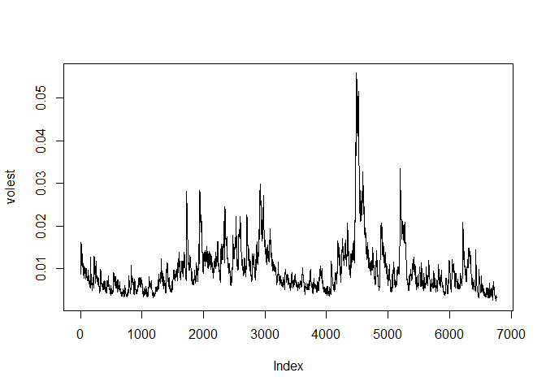
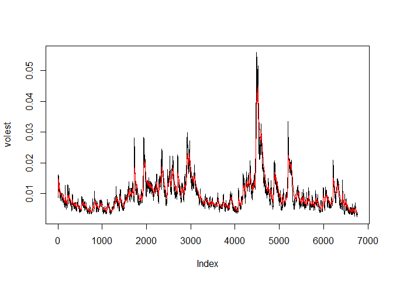
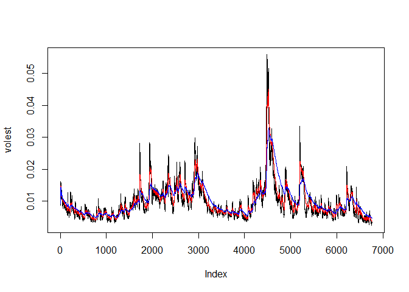

# Unit 11: Modeling Financial Data
Eric McCandless  
November 6, 2017  

# Description: Analyzing SP500 financial data for educational purposes to practice calculating log returns, calculate volatility measures, test different decay measures, and plotting.

## S&P 500 (^GSPC)
## SNP - SNP Real Time Price. Currency in USD

### TODO: Download the data of SP500 '^gspc'.

```r
library(tseries)
```

```
## Warning: package 'tseries' was built under R version 3.4.2
```

```r
SNPdata <- get.hist.quote('^gspc', quote="Close")
```

```
## 'getSymbols' currently uses auto.assign=TRUE by default, but will
## use auto.assign=FALSE in 0.5-0. You will still be able to use
## 'loadSymbols' to automatically load data. getOption("getSymbols.env")
## and getOption("getSymbols.auto.assign") will still be checked for
## alternate defaults.
## 
## This message is shown once per session and may be disabled by setting 
## options("getSymbols.warning4.0"=FALSE). See ?getSymbols for details.
```

```
## 
## WARNING: There have been significant changes to Yahoo Finance data.
## Please see the Warning section of '?getSymbols.yahoo' for details.
## 
## This message is shown once per session and may be disabled by setting
## options("getSymbols.yahoo.warning"=FALSE).
```

```
## time series ends   2017-11-03
```

```r
length(SNPdata)
```

```
## [1] 6765
```

### TODO: Calculate the log returns, which is the subtraction of log(lag(SNPdata)) and log(SNPdata)

```r
SNPret <- log(lag(SNPdata)) - log(SNPdata)
```

### TODO: Calculate volatility measure that is to multiply sd(SNPret),sqrt(250), 100

```r
SNPvol <- sd(SNPret) * sqrt(250) * 100
```

### Define getVol function for volatility

```r
getVol <- function(d, logrets) {
	var = 0
	lam = 0
	varlist <- c()

	for (r in logrets) {
		lam = lam*(1 - 1/d) + 1
	  var = (1 - 1/lam)*var + (1/lam)*r^2
		varlist <- c(varlist, var)
	}

	sqrt(varlist)
}
```

### Calculate volatility over entire length of series for various three different decay factors: 10 30. 100

### TODO: call getVol function with the parameters: 10,SNPret

```r
volest <- getVol(10,SNPret)
```

### TODO: call getVol function with the parameters: 30,SNPret

```r
volest2 <- getVol(30,SNPret)
```

### TODO: call getVol function with the parameters: 100,SNPret

```r
volest3 <- getVol(100,SNPret)
```

### Plot the results, overlaying the volatility curves on the data, just as was done in the S&P example.

```r
plot(volest, type="l")
```

<!-- -->

### TODO: Add connected line segments for volest2 with the parameters: type="l",col="red"

```r
plot(volest, type="l")
lines(volest2, type="l", col="red")
```

<!-- -->

### TODO: Add connected line segments for volest3 with the parameters: type="l",col="blue"

```r
plot(volest, type="l")
lines(volest2, type="l", col="red")
lines(volest3, type="l", col="blue")
```

<!-- -->
