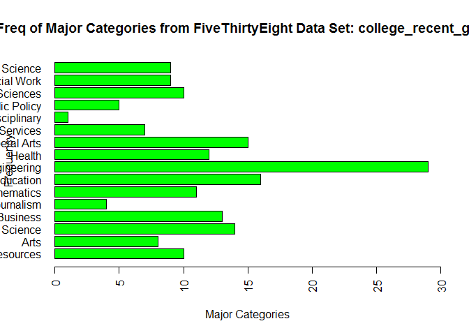

# Unit 4 Assignment
Eric McCandless  
September 21, 2017  

## Session info

```r
sessionInfo()
```

```
## R version 3.4.1 (2017-06-30)
## Platform: x86_64-w64-mingw32/x64 (64-bit)
## Running under: Windows 7 x64 (build 7601) Service Pack 1
## 
## Matrix products: default
## 
## locale:
## [1] LC_COLLATE=English_United States.1252 
## [2] LC_CTYPE=English_United States.1252   
## [3] LC_MONETARY=English_United States.1252
## [4] LC_NUMERIC=C                          
## [5] LC_TIME=English_United States.1252    
## 
## attached base packages:
## [1] stats     graphics  grDevices utils     datasets  methods   base     
## 
## loaded via a namespace (and not attached):
##  [1] compiler_3.4.1  backports_1.1.0 magrittr_1.5    rprojroot_1.2  
##  [5] tools_3.4.1     htmltools_0.3.6 yaml_2.1.14     Rcpp_0.12.12   
##  [9] stringi_1.1.5   rmarkdown_1.6   knitr_1.17      stringr_1.2.0  
## [13] digest_0.6.12   evaluate_0.10.1
```
$~$

## 1. FiveThirtyEight Data (30 points): Navigate on GitHub to https://github.com/rudeboybert/fivethirtyeight and read README.md. Seriously, it will include every command you need. Test out some commands on R.

$~$

### a. Install the fivethirtyeight package.


```r
install.packages("fivethirtyeight",repos = "http://cran.us.r-project.org")
```

```
## package 'fivethirtyeight' successfully unpacked and MD5 sums checked
## 
## The downloaded binary packages are in
## 	C:\Users\emccandless\AppData\Local\Temp\RtmpUDyrRB\downloaded_packages
```

### b. In the listing of Data sets in package 'fivethirtyeight,' assign the eighteenth data set to an object 'df.'


```r
library(fivethirtyeight)
df <- data.frame(college_recent_grads)
```

### c. Use a more detailed list of the data sets to write out the URL in a comment to the related news story.


```r
vignette("fivethirtyeight", package = "fivethirtyeight")
```

```
## starting httpd help server ... done
```

### http://fivethirtyeight.com/features/the-economic-guide-to-picking-a-college-major/

### d. Using R command(s), give the dimensions and column names of this data frame.


```r
dim(df)
```

```
## [1] 173  21
```

```r
colnames(df)
```

```
##  [1] "rank"                        "major_code"                 
##  [3] "major"                       "major_category"             
##  [5] "total"                       "sample_size"                
##  [7] "men"                         "women"                      
##  [9] "sharewomen"                  "employed"                   
## [11] "employed_fulltime"           "employed_parttime"          
## [13] "employed_fulltime_yearround" "unemployed"                 
## [15] "unemployment_rate"           "p25th"                      
## [17] "median"                      "p75th"                      
## [19] "college_jobs"                "non_college_jobs"           
## [21] "low_wage_jobs"
```

## 2. Data Summary (30 points): Use your newly assigned data frame for Question 2.

### a. Write an R command that gives you the column names of the data frame. Right after that, write one that counts the number of columns but not rows. Hint: The number should match one of your numbers in Question 1d for dimensions.


```r
colnames(df)
```

```
##  [1] "rank"                        "major_code"                 
##  [3] "major"                       "major_category"             
##  [5] "total"                       "sample_size"                
##  [7] "men"                         "women"                      
##  [9] "sharewomen"                  "employed"                   
## [11] "employed_fulltime"           "employed_parttime"          
## [13] "employed_fulltime_yearround" "unemployed"                 
## [15] "unemployment_rate"           "p25th"                      
## [17] "median"                      "p75th"                      
## [19] "college_jobs"                "non_college_jobs"           
## [21] "low_wage_jobs"
```

```r
ncol(df)
```

```
## [1] 21
```

### b. Generate a count of each unique major_category in the data frame. I recommend using libraries to help. I have demonstrated one briefly in live-session. To be clear, this should look like a matrix or data frame containing the major_category and the frequency it occurs in the dataset. Assign it to major_count.


```r
library(plyr)
count(college_recent_grads, "major_category")
```

```
##                         major_category freq
## 1      Agriculture & Natural Resources   10
## 2                                 Arts    8
## 3               Biology & Life Science   14
## 4                             Business   13
## 5          Communications & Journalism    4
## 6              Computers & Mathematics   11
## 7                            Education   16
## 8                          Engineering   29
## 9                               Health   12
## 10           Humanities & Liberal Arts   15
## 11 Industrial Arts & Consumer Services    7
## 12                   Interdisciplinary    1
## 13                 Law & Public Policy    5
## 14                   Physical Sciences   10
## 15            Psychology & Social Work    9
## 16                      Social Science    9
```

```r
major_count <- count(college_recent_grads, "major_category")
```

### c. To make things easier to read, enter par(las=2) before your plot to make the text perpendicular to the axis. Make a barplot of major_count. Make sure to label the title with something informative (check the vignette if you need), label the x and y axis, and make it any color other than grey. Assign the major_category labels to their respective bar. Flip the barplot horizontally so that bars extend to the right, not upward. All of these options can be done in a single pass of barplot(). Note: It's okay if it's wider than the preview pane.


```r
par(las=2)
barplot(major_count$freq, main="Freq of Major Categories from FiveThirtyEight Data Set: college_recent_grads", xlab="Major Categories", ylab="Frequency", names.arg=c('Agriculture & Natural Resources','Arts','Biology & Life Science','Business','Communications & Journalism','Computers & Mathematics','Education','Engineering','Health','Humanities & Liberal Arts','Industrial Arts & Consumer Services','Interdisciplinary','Law & Public Policy','Physical Sciences','Psychology & Social Work','Social Science'), horiz=TRUE, col=c("green"), xlim=c(0,30))
```

<!-- -->

### d. Write the fivethirtyeight data to a csv file. Make sure that it does not have row labels.


```r
write.csv(major_count, file="major_count.csv", row.names=FALSE)
```

## 3. Codebook (30 points):

### a. Start a new repository on GitHub for your SMU MSDS homework. On your local device, make sure there is a directory for Homework at the minimum; you are welcome to add whatever you would like to this repo in addition to your requirements here.

### Created:  https://github.com/emccandlesssmu/homework

### b. Create a README.md file which explains the purpose of the repository, the topics included, the sources for the material you post, and contact information in case of questions. Remember, the one in the root directory should be general. You are welcome to make short READMEs for each assignment individually in other folders.

### c. In one (or more) of the nested directories, post your RMarkdown script, HTML file, and data from 'fivethirtyeight.' Make sure that in your README or elsewhere that you credit fivethirtyeight in some way.

##d. In your RMarkdown script, please provide the link to this GitHub so the grader can see it.

### https://github.com/emccandlesssmu/homework

## 4. Swirl (10 points): Complete Module 15 in the R Programming course of Swirl. Copy your code/output to a separate .txt file. It does not need to be included in your RMarkdown file. The grader has requested at minimum to show the 90%-100% progress bar for the module and what output you had for it.
## a. Complete "15: Graphics Basics"# 

### Please see text file.

